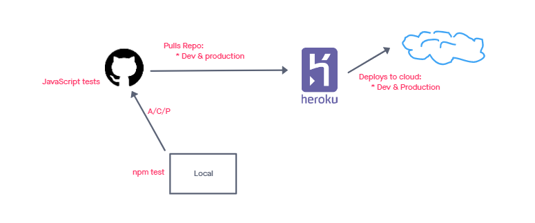

# Lab-01

## Server Deployment Practice

### Author: Alan Chelko

    * Server testing
    * CI/CD with Github and Heroku

### Setup

    * PORT: 3002

### Running the app

    * npm start
    * Endpoint: '/'
        * returns 'Hello World'
    * Endpoint: '/bad'
        * returns object with 500 error
    * Enpoint: '/*' (i.e. anything other than '/bad')
        * returns object with 404 error

### Tests

    * npm test

### UML: CI/CD Process

